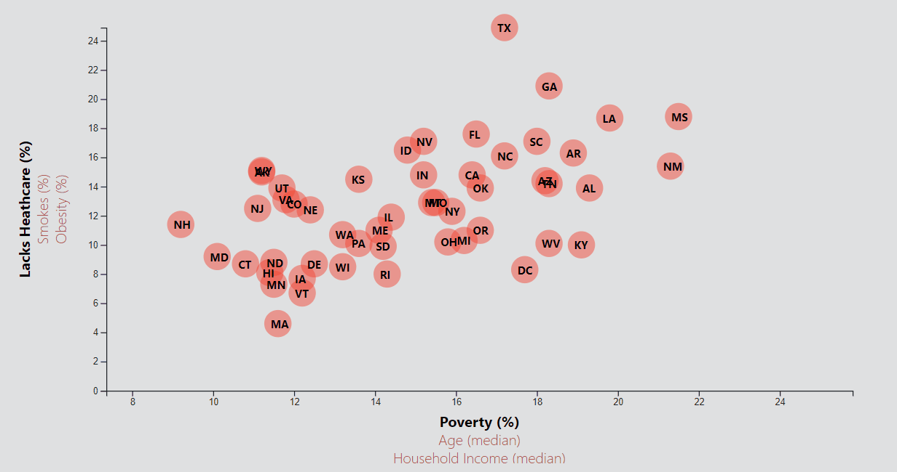

#Week 16: D3-Challenge
By A. Rijpkema 2/11/2020

More Javascript this week as D3.js is introduced. The challenge: to take the results of a 2014 survey into the correlation between income, age, poverty, smoking, obesity and heath care in the 50 different states of the USA.

With interactive x- and y-axis, tooltips and transition features, it was a pretty tedious, but in the end rewarding way of programming this interactive webpage.

[Here's](https://dutchds.github.io/D3-Challenge/index.html) the website. And a little video to see how it works in a glance:  

 

